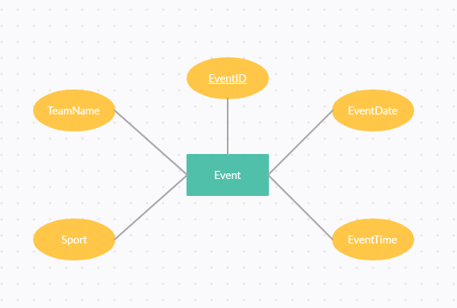
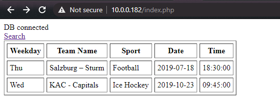
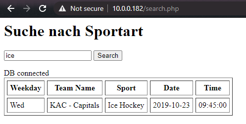

# SportradarCodingExercise
Getestet habe ich das ganze auf einer Ubuntu-Server VM
* Webbrowser: Apache2
* Database:   Mysql
## ERD


## index.php
index.php zeigt alle Event-Einträge in einer Tabelle an.  


## search.php
In search.php kann man nach Sportarten filtern. Dazu gibt man die gesuchte Sportart in das Suchfeld ein und bekommt eine Liste aller Events dieser Sportart.  


## Erweiterungen
### Datenbank
Falls man zusätzliche Daten (Wie z.B. Statistiken,etc.) zu den Teams oder Sportarten speichern will, muss man die Datanbank erweitern.  
Es müssen dann neue Tabellen für die Teams oder Sportarten erstellt werden und mit den Events über ForeignKeys verbunden werden.  

```mysql

CREATE TABLE Sport (
  SportID INT AUTO_INCREMENT,
  SportName VARCHAR(255),
  UNIQUE (SportName),
  PRIMARY KEY (SportID)
);

-- TODO ??? ich könnte dem Team auch die SportID als foreignKey mitgeben und sie aus dem event entfernen
CREATE TABLE Team (
  TeamID INT AUTO_INCREMENT,
  TeamName VARCHAR(255),
  UNIQUE (TeamName),
  PRIMARY KEY (TeamID)
);

CREATE TABLE Event (
    EventID INT NOT NULL AUTO_INCREMENT,
    _TeamAID INT,
    _TeamBID INT,
    _SportID INT,
    EventDate DATE,
    EventTime TIME,
    PRIMARY KEY (EventID),
    FOREIGN KEY (_SportID) REFERENCES Sport(SportID),
    CONSTRAINT _TeamAID FOREIGN KEY (_TeamAID) REFERENCES Team(TeamID),
    CONSTRAINT _TeamBID FOREIGN KEY (_TeamAID) REFERENCES Team(TeamID)

);
```
